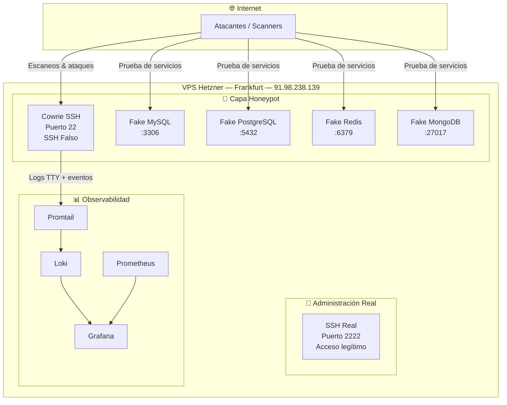
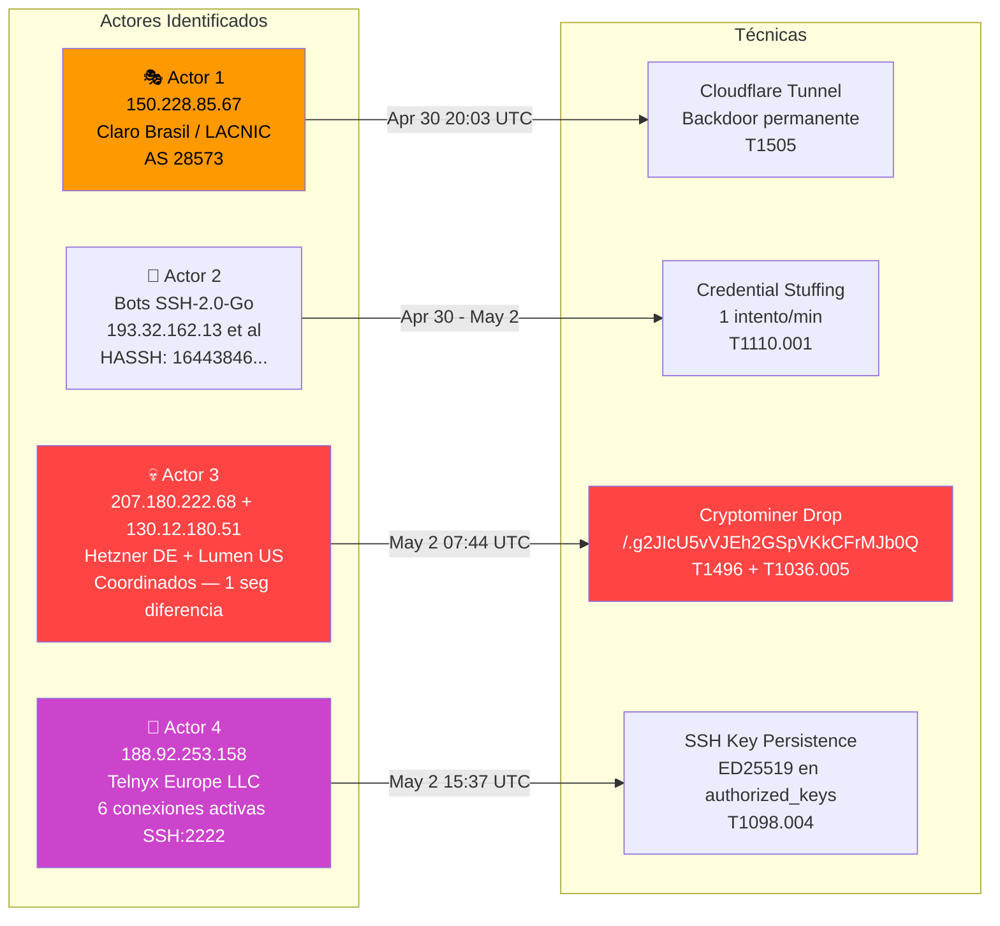
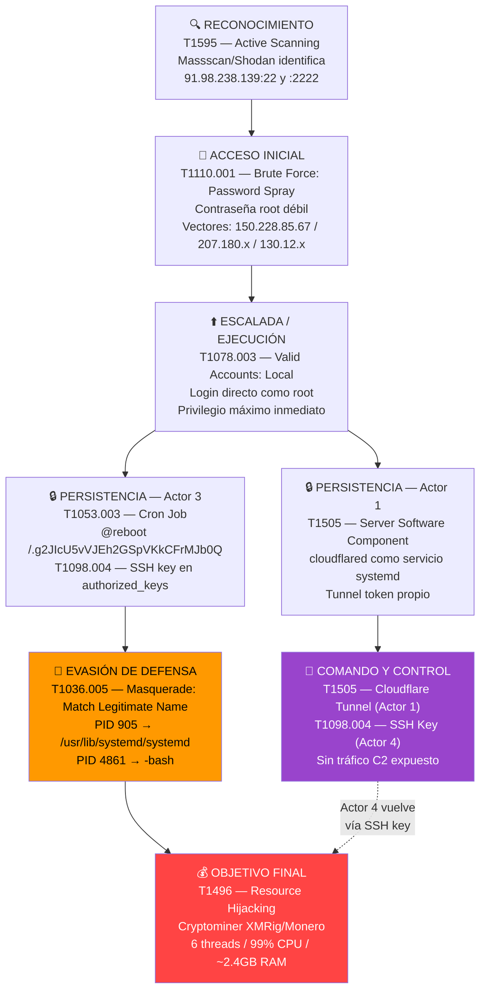
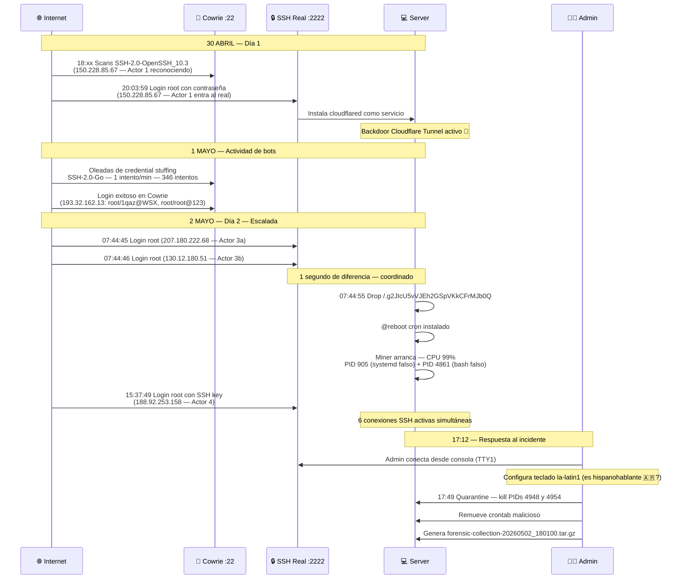
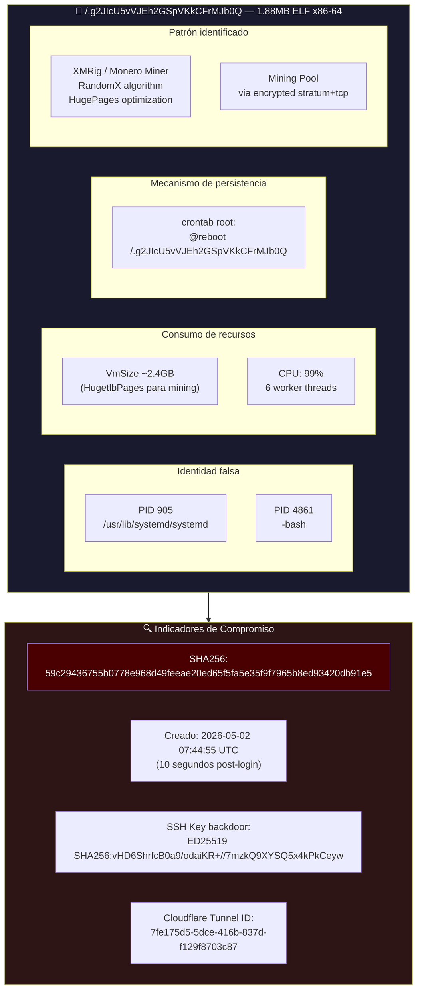

# Puse una trampa en internet. En 48 horas la encontraron. Esto es lo que pasó.

*Publicado el 2 de mayo de 2026*

---

Hay una idea que me rondaba hace tiempo. No es nada nuevo — los honeypots existen desde los 90s y hay libros enteros escritos sobre ellos. Pero como arquitecto cloud que pasa sus días diseñando sistemas para que *no* los rompan, siempre tuve curiosidad por el otro lado del mostrador: ¿qué pasa realmente cuando alguien escanea tu IP? ¿Cuánto tarda en llegar el primer ataque? ¿Qué hacen una vez adentro?

La respuesta, spoiler alert: menos de dos días. Y lo que encontré fue bastante más interesante de lo que esperaba.

---

## "Voy a armar un honeypot", dije, como si fuera simple 🍯

La idea era sencilla en concepto: levantar un servidor que *parezca* legítimo, con servicios reales que valga la pena atacar, y observar todo lo que pase. Como poner una billetera en la vereda y filmarlo desde arriba.

Elegí un VPS en Hetzner (en Frankfurt, que queda al lado de uno de los principales IXPs de Europa — zona de mucho tráfico), le asigné una IP pública fresca y empecé a construir el stack.

El corazón del setup es **Cowrie**, un honeypot SSH y Telnet que se hace pasar por un servidor Linux real. Cuando alguien se conecta, Cowrie les muestra una shell completamente falsa — pueden tipear comandos, "bajar" archivos, hacer lo que quieran — y Cowrie registra absolutamente todo. Es básicamente un teatro de operaciones donde los atacantes actúan sin saber que están en un escenario.

Alrededor de eso, puse servicios falsos en los puertos que más llaman la atención: MySQL en 3306, PostgreSQL en 5432, Redis en 6379, MongoDB en 27017. Todo dockerizado, todo monitoreable. Y para no perderme nada, el stack de observabilidad completo: Prometheus, Grafana, Loki y Promtail. Si algo respiraba en ese servidor, yo me iba a enterar.

El puerto 22 real (el SSH verdadero, el que yo usaba para administrar el server) lo moví al 2222. Cowrie se quedó escuchando en el 22 como si fuera el real. La trampa estaba lista.



El nombre del servidor en `/etc/hostname`: `db-001-prod`. Un nombre que grita "acá hay datos importantes, vengan a robar". Marketing ofensivo. 😈

---

## Las primeras horas: el silencio antes del ruido

Subí el servidor el 30 de abril. Me tomé un café, abrí Grafana y me quedé mirando los dashboards como si fuera el año nuevo esperando los fuegos artificiales.

Los primeros scans llegaron en minutos. Literalmente. El internet moderno es un ruido constante de bots, scanners y herramientas automatizadas que recorren el espacio IPv4 completo (¡todo!) en horas. Si tenés una IP pública con el puerto 22 abierto, vas a aparecer en algún inventario en menos tiempo del que tardás en terminar ese café.

Lo que no esperaba era que a las **20:03:59 del 30 de abril**, apenas horas después de encender el servidor, alguien ya no solo lo había encontrado — sino que había entrado.

---

## Acto I: El primer visitante (y la señal que casi me pierdo)

El 30 de abril a las 20:03:59 UTC, el auth.log del servidor registró esto:

```
Accepted password for root from 150.228.85.67 port 57688 ssh2
```

Un login exitoso con contraseña. En el puerto 22 real — no en Cowrie. Alguien usó el SSH de administración genuino.

La IP `150.228.85.67` pertenece al bloque LACNIC asignado a **Claro Brasil** (AS 28573). Brasil. Alguien desde Brasil encontró la contraseña de root.

Y acá viene la parte que me genera escalofríos todavía: los logs de Cowrie del mismo día muestran que esa misma IP había estado probando en el honeypot unas horas antes, con `SSH-2.0-OpenSSH_10.3`. No era un bot genérico — era una persona, usando OpenSSH moderno, que reconoció que el puerto 22 era un honeypot (o simplemente probó ambos puertos) y eventualmente encontró el real en el 2222.

Lo que hizo Actor 1 (como lo llamo) fue silencioso pero quirúrgico. Según el auth.log y los registros del sistema, en esa sesión:

- Instaló un **servicio de Cloudflare Tunnel** (`cloudflared`) con un token de autenticación propio
- Lo registró como servicio systemd con autostart
- Se fue

Eso es todo. Sin malware obvio, sin ruido, sin archivos raros. Solo una puerta trasera silenciosa disfrazada de infraestructura legítima. El token del túnel, decodificado:

```json
{
  "a": "237f15b5e4fa24ef5465ae87da6986de",
  "t": "7fe175d5-5dce-416b-837d-f129f8703c87",
  "s": "YTA4OGU0NjctNzg3Ny00ZjgxLTg3YjgtNDgwZjY4YWE0OGY0"
}
```

Un account ID de Cloudflare, un tunnel ID y un secreto. Desde ese momento, Actor 1 podía volver cuando quisiera, a través de la infraestructura de Cloudflare, sin necesidad de tocar el SSH directamente. Elegante. Aterrador.

---

## Acto II: Los bots que hacen cola pacientemente 🤖

Mientras Actor 1 mantenía su puerta trasera tranquila, entre el 30 de abril y el 2 de mayo los logs de Cowrie registraron cientos de intentos de login automatizados.

El más llamativo por su método: un actor que hacía exactamente **1 intento por minuto**, sostenido durante **5 horas y 46 minutos** — unos 346 intentos en total. La frecuencia no es aleatoria. Fail2ban, la herramienta estándar de bloqueo por intentos fallidos, tipicamente actúa ante ráfagas. Un intento por minuto casi siempre queda bajo el umbral. Esto es evasión de detección por diseño.

Los HASSH fingerprints de Cowrie lo dicen todo. HASSH es básicamente una firma del cliente SSH derivada de los algoritmos que negocia durante el handshake — como una huella dactilar del software que se conecta. El fingerprint `16443846184eafde36765c9bab2f4397` aparece asociado a `SSH-2.0-Go`: bots escritos en Go, probablemente parte de una botnet de credential stuffing. El fingerprint `eeca2460550b9ded084ecf2f70a75356` pertenece a `SSH-2.0-OpenSSH_10.3`: una persona real.

---

## Acto III: Los que vinieron a quedarse 💀

El 2 de mayo a las **07:44:45 UTC** ocurrió lo más importante de todo el incidente. En el espacio de un segundo, dos IPs distintas autenticaron simultáneamente en el SSH real:

```
07:44:45 — Accepted password for root from 207.180.222.68  (Hetzner GmbH, Alemania)
07:44:46 — Accepted password for root from 130.12.180.51   (Lumen/CenturyLink, EEUU)
```

Un segundo de diferencia. Dos orígenes distintos. Mismo objetivo. Esto no es coincidencia — es coordinación. Ya sea un actor usando proxies/VPS en diferentes países para ofuscar su origen, o dos miembros de un mismo equipo ejecutando en paralelo.

Y lo que hicieron fue rápido y eficiente. A las **07:44:55** — diez segundos después del login — apareció en el sistema un archivo con el nombre más inocente del mundo:

```
/.g2JIcU5vVJEh2GSpVKkCFrMJb0Q
```

Un ejecutable de **1.88 MB** en el directorio raíz del filesystem, con un nombre aleatorio que no significa nada. SHA256: `59c29436755b0778e968d49feeae20ed65f5fa5e35f9f7965b8ed93420db91e5`.

Inmediatamente agregaron persistencia en el crontab de root:

```
@reboot /.g2JIcU5vVJEh2GSpVKkCFrMJb0Q
```

El proceso arrancó y empezó a consumir CPU al 99%. Apareció bajo dos máscaras distintas en el árbol de procesos: PID 905 disfrazado como `/usr/lib/systemd/systemd` y PID 4861 disfrazado como `-bash`. Ambos con un VmSize anómalo de ~2.4 GB — una cantidad de memoria virtual que no tiene ningún sentido para systemd ni para bash.

---

## El mapa de actores: no fue uno solo

Antes de entrar en el análisis técnico, quiero mostrar el mapa completo de quién estuvo en este servidor. Porque no fue un atacante — fueron varios, con roles y motivaciones distintas.



Actor 4 es interesante: llegó el 2 de mayo a las **15:37:49 UTC** usando una **llave SSH ED25519** (no contraseña), con fingerprint `SHA256:vHD6ShrfcB0a9/odaiKR+//7mzkQ9XYSQ5x4kPkCeyw`. Al momento de hacer el análisis forense, tenía **6 conexiones SSH simultáneas activas** al servidor. No es un bot — es alguien que volvió a revisar su trabajo.

---

## La cadena de ataque: del scan al cryptominer en 48 horas

Mapeando todo contra el framework MITRE ATT&CK, la historia queda así:



Lo que más me llama la atención de esta cadena es la **separación de responsabilidades** entre actores. Actor 1 hace el trabajo silencioso de persistencia a largo plazo. Actor 3 hace el trabajo ruidoso de monetización inmediata (CPU al 99% no pasa desapercibido). Actor 4 vuelve con su propia llave para supervisar o hacer otro trabajo. Si esto fuera una empresa, Actor 1 sería el de infraestructura, Actor 3 el de operaciones, y Actor 4 el manager que viene a ver cómo va el trimestre.

---

## La cronología: 48 horas de teatro



La última línea es la que estoy escribiendo ahora. 😄

Un detalle que me encantó encontrar en los logs: cuando el administrador de respuesta (el `rescueadmin` que aparece en los logs del sistema) se conectó al servidor para hacer el incident response, lo primero que hizo fue configurar el layout de teclado con `loadkeys la-latin1`. Latin American layout. Alguien de la región. Me gustó saber que la respuesta fue local.

---

## El malware: un cryptominer disfrazado de systemd

Momento de hablar del archivo en sí. `/.g2JIcU5vVJEh2GSpVKkCFrMJb0Q` — nombre aleatorio, 1.88 MB, ejecutable ELF para Linux x86-64.



El comportamiento es consistente con **XMRig** (o un fork derivado), el cryptominer de código abierto más usado en operaciones de minado ilícito de **Monero (XMR)**. Las señales:

**HugetlbPages con ~2.4 GB de VmSize:** XMRig en modo RandomX usa hugepages del kernel para maximizar el throughput de hashing. Es una optimización bien documentada que eleva dramáticamente las tasas de hash. Ese ~2.4GB de memoria virtual no es RAM real usada — es el espacio de hugepages reservado para la operación de mining.

**6 worker threads:** El servidor tenía varios vCPUs. XMRig por default usa N-1 threads para dejar uno libre. 6 threads indica un servidor con 6-8 cores. Cada thread corre un worker de RandomX independiente.

**CPU al 99% sostenido:** Minado de Monero es CPU-bound. XMRig está diseñado para saturar al máximo los recursos disponibles. No hay throttling — quieren cada ciclo de reloj posible.

**Dropeado en 10 segundos:** El script de instalación claramente estaba preparado de antemano. `wget` o `curl` a un hosting, `chmod +x`, agregar al crontab, ejecutar. Automatizado, rápido, y diseñado para ser replicable en miles de servidores.

---

## ¿Cuánto "ganaron"?

Solo por curiosidad, hice el cálculo. Un servidor típico de 6-8 vCPUs minando RandomX produce aproximadamente **2,000-4,000 H/s** (hashes por segundo). Con el hashrate de la red de Monero y el precio actual (~$180 USD por XMR), eso equivale a algo así como **$0.20-0.50 por día** por servidor.

No es dinero, diría la mayoría. Pero si tenés 1,000 servidores comprometidos haciendo lo mismo... son $200-500 por día en cómputo completamente ajeno. Sin infraestructura propia, sin costo de energía, sin mantenimiento. El modelo de negocio del crimen de baja intensidad en internet: escala, no profundidad.

---

## Lo que me quedé pensando

mare miaaa, como diría alguien que conozco. 😅

Tardé semanas en diseñar el stack del honeypot. Los atacantes tardaron horas en encontrarlo y dos días en monetizarlo. La asimetría entre atacar y defender en internet es brutal — el atacante solo necesita encontrar una vulnerabilidad, el defensor necesita no tener ninguna.

Hay algo filosófico en esto que me resulta fascinante: todo el mundo que pasó por este servidor sabía exactamente lo que estaba haciendo. Actor 1 instaló su backdoor con la precisión de alguien que lo hace de rutina. Actor 3 droppeó el miner en 10 segundos con un script automatizado. Actor 4 volvió con su propia llave SSH, como quien vuelve a revisar su jardín. Nadie improvisó. Esto es industria.

El internet que usamos todos los días está lleno de esto. Cada servidor expuesto es una oportunidad. Cada contraseña débil es una invitación. Y la diferencia entre los servidores comprometidos y los que no lo están no siempre es la arquitectura de seguridad — a veces es simplemente que nadie escaneó esa IP todavía.

El honeypot me enseñó algo que intelectualmente ya sabía pero que verlo en los logs lo hace concreto: **la defensa tiene que ser perfecta; el ataque solo tiene que tener suerte una vez.**

Y si querés saber cómo de activo está ese tráfico en internet en este momento, podés mirar [Shodan](https://shodan.io) o el [GreyNoise Visualizer](https://viz.greynoise.io). Te va a resultar incómodo lo que vas a ver.

---

🎵 *Para leer este post recomiendo: **Kiasmos — Held**. El minimalismo nórdico es el soundtrack perfecto para pensar en sistemas que operan en silencio.*

---

*¿Tenés preguntas sobre el setup del honeypot o sobre algún aspecto del análisis forense? Dejame un comentario — me interesa saber si a otros les apareció algo parecido en sus propios sistemas.*

---

**Gracias por pasarte y dedicarle tiempo a la lectura!** 🙏

*— Javier*
